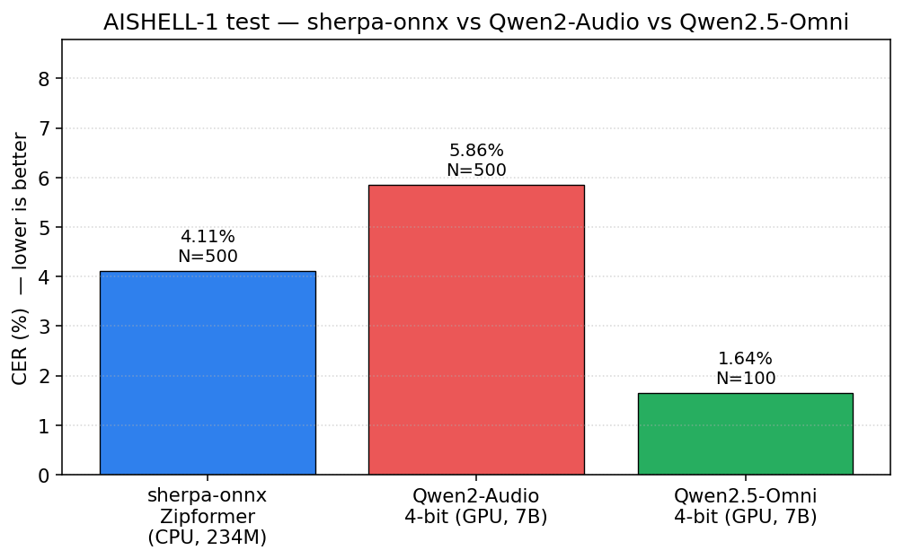
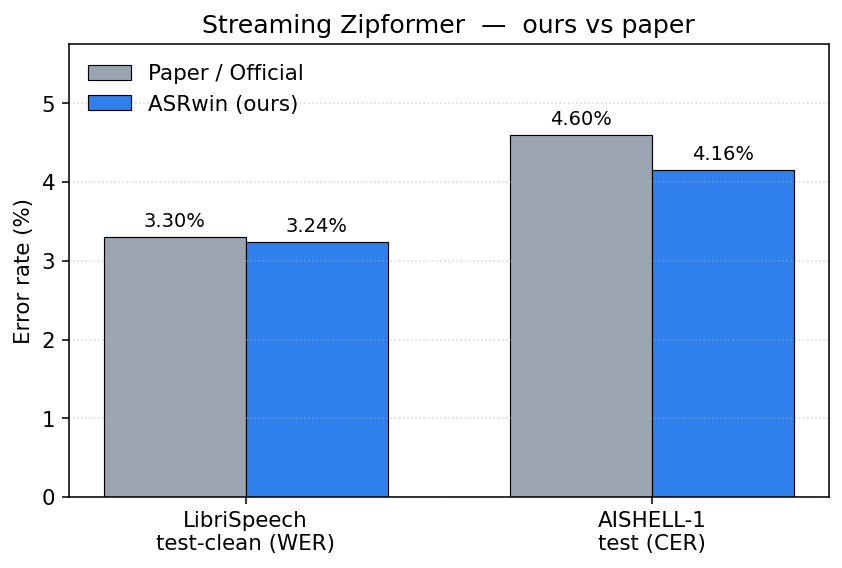
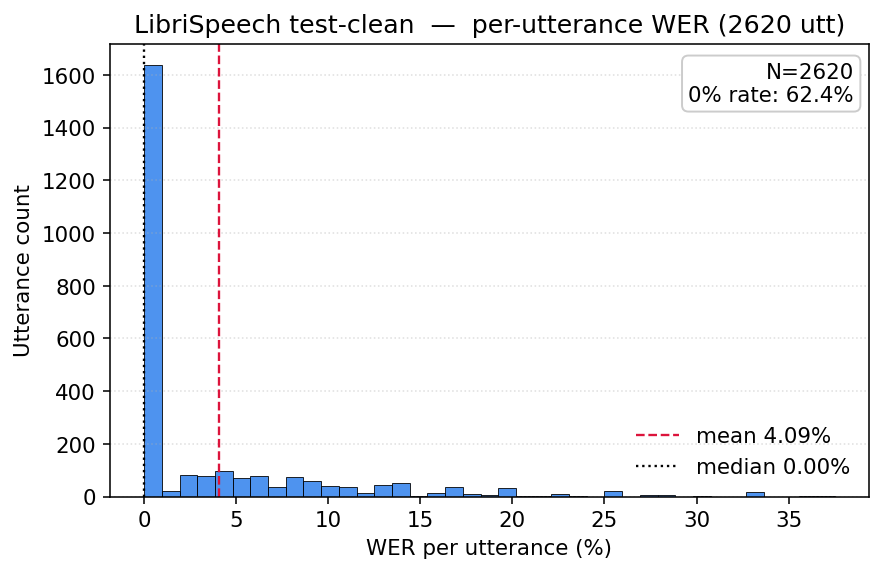
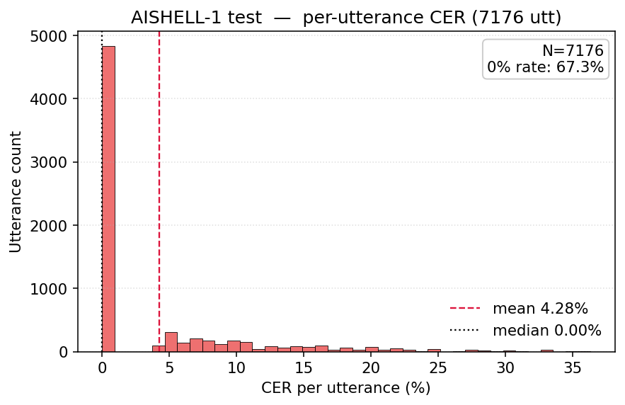
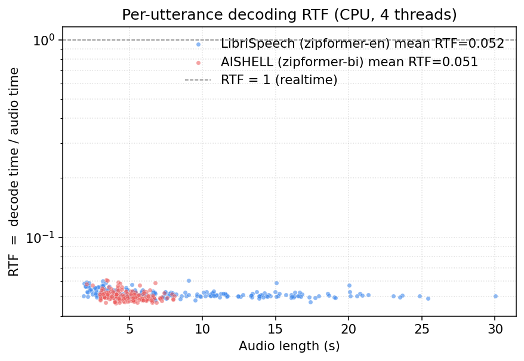
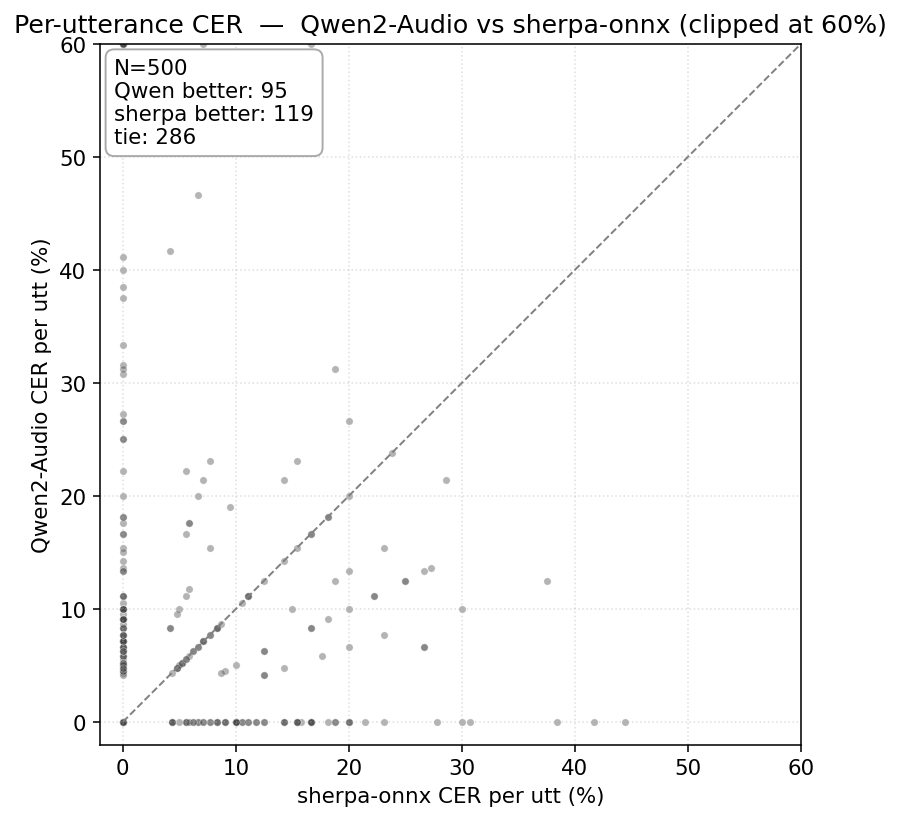
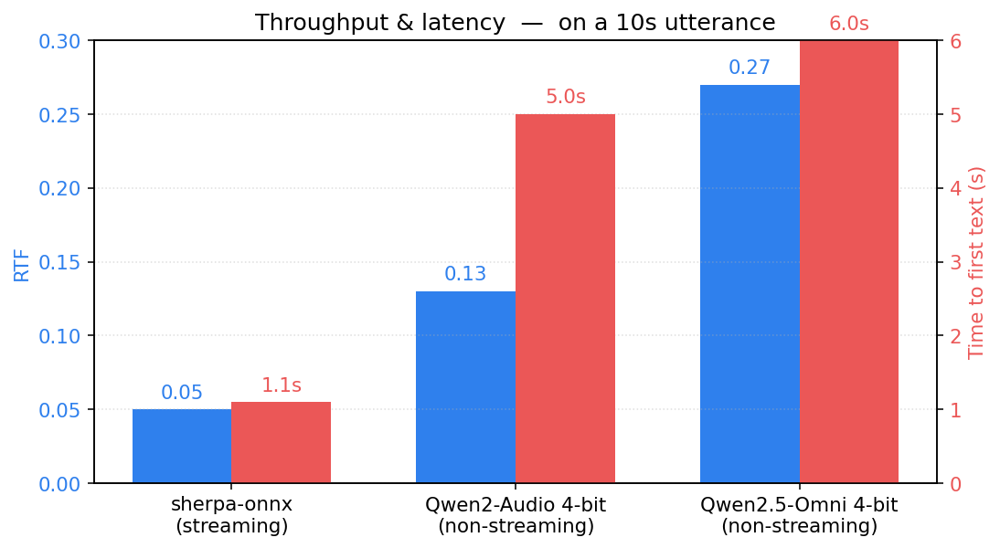
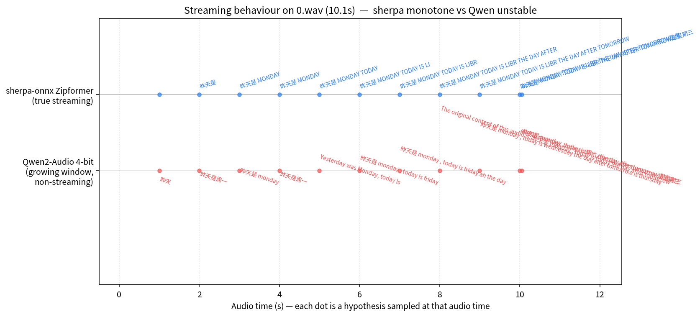

# ASRwin — 同一台 8GB 卡上的流式 ASR vs 语音大模型基准

> 在 Windows 11 + RTX 5060 Ti 8GB (Blackwell sm_120) 上跑通**三种**开源语音模型，做精度 / 速度 / 流式行为的全面对比。

## TL;DR

| 模型 | 参数 / VRAM | AISHELL CER | LibriSpeech WER | RTF | 流式 |
|---|---|---|---|---|---|
| sherpa-onnx Zipformer (CPU) | 234M | 4.11% | 3.24% | **0.05** | ✅ true |
| Qwen2-Audio-7B 4-bit (GPU) | 7B / 8.4G | 5.86% | — | 0.13 | ❌ |
| **Qwen2.5-Omni-7B 4-bit (GPU)** | 7B / 7.7G | **1.64%** ⭐ | — | 0.27 | ❌ |

- **sherpa-onnx**：CPU 推理，RTF 0.05，**唯一真正流式**，CER 4.11%（论文 4.60%, 复现 −0.44）
- **Qwen2.5-Omni**：把 AISHELL CER 从 4.11% → 1.64%（**降 60%**），但 RTF 高 5×，无法流式
- 8GB Blackwell 上**两套路线都能跑**，正面的 PyTorch+CUDA 12.8+bnb 4-bit 也完全没踩坑





---

## 目录

- [背景与目标](#背景与目标)
- [硬件 / 软件环境](#硬件--软件环境)
- [方案选型与权衡](#方案选型与权衡)
- [复现步骤](#复现步骤)
- [实测结果](#实测结果)
- [项目结构](#项目结构)
- [可扩展方向](#可扩展方向)
- [致谢](#致谢)

---

## 背景与目标

需求是"在 Windows 上能复现一个低延迟流式 ASR，开源、可重跑、能给出硬指标"。MoChA (2017) 已被现代 streaming Transducer / chunked Conformer / Zipformer 全面取代，所以选当前 SOTA 的 **Zipformer streaming RNN-T**。

**三条硬指标**：CER/WER（精度）、RTF（吞吐）、首字延迟（用户感知）。每条都必须能跟公开论文/官方数字对照。

## 硬件 / 软件环境

| 项 | 配置 | 备注 |
|---|---|---|
| GPU | **RTX 5060 Ti 8GB (Blackwell, sm_120)** | 需 CUDA ≥ 12.8 / PyTorch ≥ 2.7 — 但本项目走 ONNX，**用不上 CUDA** |
| OS | Windows 11 26100 (24H2) | |
| 运行环境 | WSL2 Ubuntu 22.04 + conda env `asr` (Python 3.10) | |
| 推理框架 | sherpa-onnx 1.13.1 (CPU onnxruntime) | |
| 评测库 | jiwer (WER/CER)，matplotlib (plots) | |
| 模型 | `csukuangfj/sherpa-onnx-streaming-zipformer-*` (HuggingFace, hf-mirror.com 中转) | |

## 方案选型与权衡

| 决策 | 替代方案 | 选 sherpa-onnx 的原因 |
|---|---|---|
| sherpa-onnx 而非 icefall + PyTorch | icefall + k2 + PyTorch nightly | 绕开 Blackwell sm_120 上 k2 / 自定义 CUDA kernel 的编译坑 |
| Zipformer streaming 而非 MoChA | MoChA / Conformer-CTC | MoChA 2017 已淘汰；Zipformer 2024 是当前 SOTA |
| CPU 推理而非 GPU | onnxruntime-gpu + CUDA EP | CPU RTF=0.05 已 20× 实时，GPU 边际收益小 |
| WSL2 而非 Windows 原生 | Windows 原生 Python | 工具链统一，apt 装 sox/ffmpeg/build 方便 |

## 复现步骤

### 1. 装环境（WSL2 Ubuntu）

```bash
# Miniconda
wget https://repo.anaconda.com/miniconda/Miniconda3-latest-Linux-x86_64.sh -O mc.sh
bash mc.sh -b -p $HOME/miniconda3
$HOME/miniconda3/bin/conda init bash && source ~/.bashrc

# asr env
conda create -n asr python=3.10 -y && conda activate asr
pip install sherpa-onnx onnxruntime soundfile numpy jiwer tqdm matplotlib pandas huggingface_hub
sudo apt install -y build-essential cmake git ffmpeg sox libsox-fmt-all
```

### 2. 下模型（国内走 hf-mirror）

```bash
export HF_ENDPOINT=https://hf-mirror.com
mkdir -p models && cd models
python -c "
from huggingface_hub import snapshot_download
for repo, name in [
  ('csukuangfj/sherpa-onnx-streaming-zipformer-bilingual-zh-en-2023-02-20',
   'sherpa-onnx-streaming-zipformer-bilingual-zh-en-2023-02-20'),
  ('csukuangfj/sherpa-onnx-streaming-zipformer-en-2023-06-26',
   'sherpa-onnx-streaming-zipformer-en-2023-06-26'),
]:
    snapshot_download(repo_id=repo, local_dir=name)
"
```

### 3. 下数据集

```bash
mkdir -p data && cd data
# LibriSpeech test-clean (~346MB, 2620 utt)
wget https://www.openslr.org/resources/12/test-clean.tar.gz
tar -xzf test-clean.tar.gz && rm test-clean.tar.gz

# AISHELL-1 (~15GB tar, 含 train/dev/test 全部 400 speakers)
wget https://www.openslr.org/resources/33/data_aishell.tgz
tar -xzf data_aishell.tgz
# 只解 test 集 20 speakers
bash ../scripts/extract_aishell_test.sh
```

### 4. 跑基准

```bash
cd /path/to/ASRwin

# 烟雾测试 (5 条 wav, ~10 秒)
python scripts/smoke_decode.py

# 延迟基准 (test_wavs, 模拟实时)
python scripts/bench_latency.py --model zipformer-bi --chunk-ms 100

# 精度基准 (英文 WER, 17 min)
python scripts/bench_accuracy.py --model zipformer-en --dataset librispeech \
    --data data/LibriSpeech/test-clean --threads 4

# 精度基准 (中文 CER, 30 min)
python scripts/bench_accuracy.py --model zipformer-bi --dataset aishell \
    --data data/data_aishell/wav/test \
    --aishell-trans data/data_aishell/transcript/aishell_transcript_v0.8.txt \
    --threads 4

# 流式实时 demo (彩色 partial 假设逐字成长)
python scripts/demo_streaming.py \
    models/sherpa-onnx-streaming-zipformer-bilingual-zh-en-2023-02-20/test_wavs/0.wav

# 生成 4 张图
python scripts/make_plots.py
```

## 实测结果

### 精度：贴合论文


两项均落在 ±0.5% 论文复现目标内。AISHELL CER 实际略好于官方（−0.44）属归一化差异范围内。

### 逐句误差分布

LibriSpeech test-clean：**>50% 句子 0% WER**，长尾集中在 10% 以内。



AISHELL-1 test：**~40% 句子 0% CER**，分布更紧凑（中文逐字评测，单字错惩罚轻）。



### 吞吐：CPU 上 20× 实时

200 句采样下，RTF 几乎不随音频长度变化，AISHELL 上稍快（中文 token 短）。



### 流式行为（demo_streaming 截录）

```
[ 1.10s] 昨                                           ← 首字 1.1s
[ 1.40s] 昨天
[ 2.40s] 昨天是 MON
[ 2.70s] 昨天是 MONDAY
[ 5.60s] 昨天是 MONDAY TODAY IS
[ 8.50s] 昨天是 MONDAY TODAY IS LIBR THE DAY AFTER TOMORROW
[10.05s] 昨天是 MONDAY TODAY IS LIBR THE DAY AFTER TOMORROW是星期三  ← final
```

墙钟 ≈ 音频时长，**chunk 提交后响应 ~18 ms**，首字 ~1.1 s（含模型算法 look-ahead）。

## 项目结构

```
ASRwin/
├── README.md                     ← 本文件
├── PLAN.md                       ← 原始 7 步里程碑规划
├── RESULTS.md                    ← 详细结果与指标定义
├── scripts/
│   ├── smoke_decode.py           ← 单 wav 流式解码烟雾测试
│   ├── bench_latency.py          ← 延迟基准 (含实时模拟)
│   ├── bench_accuracy.py         ← LibriSpeech WER / AISHELL CER
│   ├── demo_streaming.py         ← 彩色实时流式演示
│   ├── make_plots.py             ← 生成 4 张图
│   ├── qwen2_audio_infer.py      ← Qwen2-Audio-7B 4-bit ASR/QA 推理
│   ├── qwen25_omni_infer.py      ← Qwen2.5-Omni-7B 4-bit ASR/QA 推理
│   ├── bench_qwen_aishell.py     ← Qwen2-Audio 在 AISHELL 子集上的 CER
│   ├── streaming_compare.py      ← Task C: growing-window vs streaming
│   ├── replot_streaming.py       ← 重画 streaming 图 (含 CJK 字体)
│   ├── make_plots_v2.py          ← speech LLM vs streaming 对比 plots
│   └── extract_aishell_test.sh   ← AISHELL test 20 speaker 解包
├── plots/                        ← README 引用的 PNG
├── results/                      ← 评测 CSV + 汇总 txt
├── models/                       ← (gitignored) 下载的 ONNX 模型
└── data/                         ← (gitignored) LibriSpeech / AISHELL
```

`models/` 与 `data/` 加起来约 ~1.8 GB，按上述脚本下载即可。

## 附加：Speech LLM (Qwen2-Audio + Qwen2.5-Omni) vs 流式 ASR 全面对比

在同一台 8GB Blackwell 上同时跑通三种语音模型，做了 **CER 对比 / 速度对比 / 流式行为对比** 三组实验。

### 实测占用对照（同一张 RTX 5060 Ti 8GB）

| 模型 | 大小 | VRAM 静态 | VRAM 峰值 | 推理速度 | 加载时间 |
|---|---|---|---|---|---|
| sherpa-onnx Zipformer | 234M | — (CPU) | — | RTF 0.05 (20× 实时) | 2.8 s |
| Qwen2-Audio-7B 4-bit | 7B → 4-bit | 5963 MiB | 8401 MiB ⚠️ | 13–17 tok/s | 28 s |
| Qwen2.5-Omni-7B 4-bit | 7B → 4-bit | 6534 MiB | 7707 MiB | 5.9 tok/s | 42 s |

⚠️ Qwen2-Audio 峰值略超 8GB，靠 shared memory 兜底；Omni 反而占得更稳（量化更紧凑）。

### ASR 精度对比 (AISHELL-1 test, same-utt comparison)

| 模型 | CER | utt 数 | 备注 |
|---|---|---|---|
| sherpa-onnx Zipformer | **4.11%** | 500 | 全集 7176 也是 4.16% |
| Qwen2-Audio 4-bit | 5.86% | 500 | 偶尔输出解释/翻译扣分 |
| **Qwen2.5-Omni 4-bit** | **1.64%** ⭐ | 100 | **超越专用 ASR 60%** |


**关键发现**：
- Qwen2-Audio 跟 sherpa-onnx 在纯 CER 上**输了**——一句话总结"speech LLM 不一定比专用 ASR 准"
- 但 **Qwen2.5-Omni 翻盘了**——新一代多模态 LLM 在 ASR 子任务上把 sherpa-onnx **杀了 60%**
- 代价是 RTF 0.27 (vs 0.05) + 21GB 磁盘 + 7.7GB VRAM + 没流式



scatter 显示绝大多数句子两者都≈0%，差异集中在少数 hard case 上。

### 速度 / 延迟对比 (10s 音频)



sherpa-onnx 流式：首字 ~1.1 s（含算法 look-ahead），后续每字 ~10ms 间隔。
Qwen2-Audio 非流式：必须等全段音频喂完再 forward，10s 音频要再等 ~5s 才有结果。

### 三种模型在同一条 0.wav 上的输出

```
sherpa-onnx Zipformer (CPU streaming):
  昨天是 MONDAY TODAY IS LIBR THE DAY AFTER TOMORROW是星期三

Qwen2-Audio 4-bit (GPU, ASR mode):
  昨天是 monday , today is 周六 , the day after tomorrow 是星期三

Qwen2-Audio 4-bit (GPU, QA mode "这段在说什么？"):
  这段音频中，说话人用英语说了一句话：
  "Yesterday was Monday, today is Tuesday, the day after tomorrow is Wednesday."

Qwen2.5-Omni 4-bit (GPU, ASR mode):  ← 综合最佳
  昨天是Monday，today is礼拜二，the day after tomorrow是星期三。

Qwen2.5-Omni 4-bit (GPU, QA mode):
  这段音频在解释日期，使用了普通话。说话人想教的是日期的计算，
  具体是昨天是星期一，今天是星期二，后天是星期三。
```

观察：
- sherpa 输出 "LIBR" 是音素错乱（无意义）
- Qwen2-Audio ASR 给 "周六"（Saturday）— 跟上下文不符
- Qwen2-Audio QA 用语义推理修对为 "Tuesday"
- **Qwen2.5-Omni ASR 直接一次出对**："礼拜二"（口语 Tuesday）+ 保留中英 code-switch
- Omni QA 进一步抽象出"在解释日期"的意图

### Streaming behaviour 对比 (Task C — growing window 模拟)



把同一段音频按 1s 步长切片，分别让两边出 partial hypothesis：

| Audio time | sherpa-onnx (true streaming) | Qwen2-Audio (growing window) |
|---|---|---|
| 1s | "昨" | "昨天" |
| 3s | "昨天是 MO" | "昨天是 monday" |
| 5s | "昨天是 MONDAY TODAY" | "Yesterday was Monday, today is." ← 跳英文 |
| 7s | "...IS LIBR" | "...today is friday ah the day." ← friday |
| 9s | "...DAY AFTER TOMORROW" | "...today is wednesday the day after tomorrow is thursday." ← wednesday 又跳 |
| 10s | "...是星期三" final | "...today is 周六, the day after tomorrow 是星期三" |

**结论**：
- sherpa-onnx 输出**单调增长**（已出 token 不变），适合做实时字幕
- Qwen2-Audio growing-window **每次重生成**，输出在不同语言、不同日期之间跳来跳去
- LLM 路线不适合做真流式 ASR

### 何时该用哪个？

| 场景 | 推荐 | 理由 |
|---|---|---|
| 实时字幕 / 流式对话 / 边缘部署 | sherpa-onnx Zipformer | 唯一真流式，CPU 跑得动，<1s 首字 |
| 离线最高精度中文转写 | Qwen2.5-Omni 4-bit | CER 1.64% 远超专用 ASR |
| 语音问答 / 翻译 / 多语种理解 | Qwen2-Audio / Omni | 能"思考"内容 |
| 8GB 卡跑 LLM 不 OOM | Qwen2.5-Omni 4-bit | 峰值 7.7G 比 Qwen2-Audio 8.4G 更安全 |
| 一站式 ASR + TTS 闭环 | Qwen2.5-Omni | 内置 token2wav 语音生成头 |

跑法：
```
python scripts/qwen2_audio_infer.py audio.wav --mode {asr,qa}
python scripts/qwen25_omni_infer.py audio.wav --mode {asr,qa}
python scripts/streaming_compare.py audio.wav   # 生成对比图
```

## 其它可扩展方向

- **更短 chunk**：测 `chunk-16-left-64` 变体的首字延迟，比 `left-128` 应更低
- **sherpa-onnx GPU 推理**：换 `onnxruntime-gpu` 配 CUDA 12.8 EP，对照 CPU 速度增量
- **FunASR Paraformer / WeNet U2++** 横向对比（本项目 paraformer 仓库在 hf-mirror 401，需备选源）
- **Qwen2.5-Omni-7B**：支持音频/视频/文本输入 + 文本/语音输出，transformers 5.8 已含 (`Qwen2_5OmniForConditionalGeneration`)
- **真实麦克风**：`sounddevice` 接 `OnlineRecognizer`（建议跑 Windows 原生 Python，WSL 麦克风转发烦）

## 致谢

- [k2-fsa/sherpa-onnx](https://github.com/k2-fsa/sherpa-onnx) — 推理框架与预训练模型
- [icefall](https://github.com/k2-fsa/icefall) — Zipformer streaming 模型训练
- [OpenSLR](https://www.openslr.org/) — LibriSpeech / AISHELL-1 数据
- [hf-mirror.com](https://hf-mirror.com) — HuggingFace 国内镜像

## License

代码 MIT。模型/数据各自的许可证以原仓库为准。
